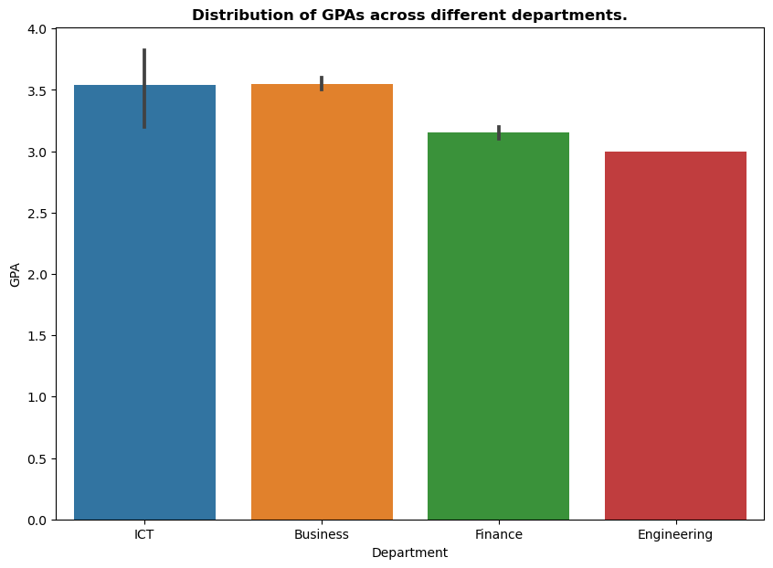

# Student Performance Analysis
### Overview
This project analyses student performance using Python, Pandas, and Seaborn. It covers data cleaning, exploratory data analysis (EDA), and visualization to uncover insights on factors affecting student GPA and graduation likelihood.

### 📂 Dataset
The dataset includes:

- Student demographics (Name, Gender, Age)
- Academic performance (GPA, Exam Scores, Credits Earned)
- Attendance & Scholarship information
- Graduation Status

### Key Steps:
1️⃣ Data Cleaning  
Checked for missing values & duplicates
Ensured data consistency

2️⃣ Sorting & Filtering  
Sorted students by GPA  
Filtered students based on attendance & GPA thresholds  

3️⃣ Statistical Analysis  
Calculated average GPA per department  
Analysed scholarship vs. non-scholarship students

4️⃣ Predictive Insights  
Identified students likely to graduate with honors  
Found top-performing courses

5️⃣ Sample Data Visualisations  
- **GPA Distribution by Department**

- **Exam Score Vs GPA**

- **Scholarship Impact on Exam Scores**

 
 Check out more analysis [here](index.ipynb)